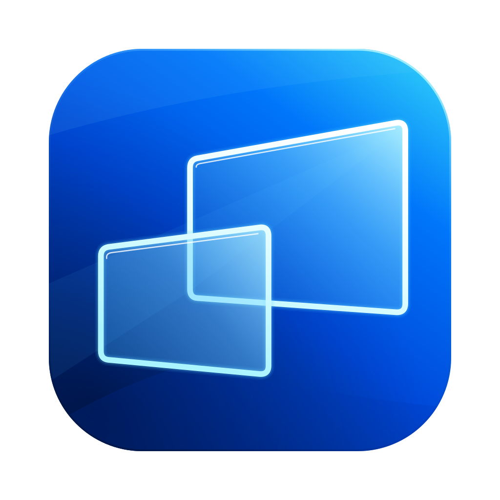

<p align="center">
  
</p>

<h1 align="center">Lyte</h1>

<p align="center"><em>Streaming at the speed of Lyte.</em></p>

<p align="center">
  <a href="https://github.com/shreeve/lyte/releases/latest">Latest release</a> ·
  <a href="#install">Install</a> ·
  <a href="#using-lyte">Using Lyte</a> ·
  <a href="docs/ARCHITECTURE.md">Architecture</a> ·
  <a href="LICENSE">MIT license</a>
</p>

Lyte lets you use a Linux desktop from your Mac as if it were in front of
you: game-streaming responsiveness with the conveniences of a remote
desktop. It owns both ends of the wire, a SwiftUI macOS client and a Swift
Linux host that speak one encrypted protocol, **Lyte-UDP**, over plain
UDP. There is no VNC, RDP, RTSP, GameStream, Sunshine or Moonlight
underneath; every datagram is sealed after a Noise handshake, and paced,
measured and repaired by Lyte's own transport.

## What you get

- **A crisp, live picture.** The host captures the screen straight from
  the GPU and encodes HEVC in hardware; the Mac decodes it in hardware and
  presents each frame on a steady beat. A still screen costs almost
  nothing on the wire. Picture tiers: Good (4:2:0) and Best (4:4:4) for
  sharp text; Better (4:2:2) waits for hardware that offers it.
- **Your keyboard and mouse, Mac-style.** ⌘ plus a letter reaches Linux
  as Ctrl plus that letter (⌘C copies, ⌘S saves, ⌘Z undoes), following
  whatever layout you type. Held keys survive a brief Wi-Fi hiccup.
- **Sound** from the host in 5 ms Opus packets, with its own mute on each
  side.
- **Clipboard and files.** Share text and images both ways, per host, and
  drop files onto the window to send them to a host that accepts files.
- **Security by default.** Every packet is encrypted; a Mac pairs with a
  host once, with a PIN, and the host is pinned by its key thereafter.
- **Resilience.** Error correction, targeted repair, congestion control
  that recovers from Wi-Fi spikes in seconds, and roaming when the host
  restarts or moves.

## Install

The Mac app needs Apple silicon and macOS 15 or later. It is signed with a
Developer ID and notarized by Apple, so it opens normally however you get
it.

**Homebrew**

```bash
brew install --cask shreeve/tap/lyte
```

**One command**, which installs the newest release into `/Applications`
(or `~/Applications`) only when it is signed with Lyte's Developer ID and
notarized, and never while Lyte is running:

```bash
curl -fsSL https://raw.githubusercontent.com/shreeve/lyte/main/Scripts/install.sh | bash
```

**Download** `Lyte.zip` from the
[latest release](https://github.com/shreeve/lyte/releases/latest) and drag
`Lyte.app` to Applications.

Lyte updates itself: **Lyte → Check for Updates…** (Sparkle), and it checks
daily on its own.

**The host** runs on Linux: one GNOME/Mutter Wayland seat with an Intel
GPU that drives the display. Build and install it with
[Host/INSTALL.md](Host/INSTALL.md).

## Using Lyte

1. **First connection.** Start the host in pairing mode
   ([pairing a client](docs/OPERATIONS.md#pairing-a-client)); its console
   shows the host key and a six-digit PIN. Pick the host in Lyte, paste
   the key (Lyte checks it against the host's advertised identity) and
   enter the PIN. When macOS asks whether Lyte may find devices on your
   local network, choose **Allow**. From then on reconnects need nothing.
2. **After that**, hosts on your network appear in the connection window
   by name; a paired host the network does not advertise appears as
   "last seen at address:port". Beyond the LAN, use Tailscale or a port
   forward; Lyte runs no relay service.
3. **In the stream window**, click to type and point on the host.

| Shortcut | What it does |
|---|---|
| ⌘ + letter | Ctrl + that letter on the host |
| ⌘⇧C · ⌘⇧V | Copy · paste in a Linux terminal (plain ⌘C there is Ctrl+C, which interrupts) |
| ⌥⌘C | Share Clipboard on or off |
| ⌥⌘I | Session stats: picture, network, audio, and why each keyframe was asked for |
| ⌘R · ⌘D | Reconnect · Disconnect |
| ⇧⌘M · ⇧⌘H | Mute on this Mac · mute the host's speakers |

The **Actions** menu also holds the picture tier, clipboard defaults per
host, **Secure Keyboard Entry** (hides your typing from other Mac apps
while the stream window is focused; off by default) and the control strip.
For Ctrl+R, Ctrl+D or Ctrl+N on the host, use the physical Ctrl key.

## Architecture

Six SwiftPM packages:

```text
Common/       LyteCore (sans-IO shared policy, the Conductor) · LyteIO · COpus
Wire/         LyteWire — the protocol: codecs, crypto, FEC, ARQ, frozen vectors
Host/         HostCore · HostSession · HostWire · HostIO · HostAudio · HostEye · lyte-host
Client/       LyteClientCore · LyteClientSession · LyteTransport · Lyte.app · lyte-cli · lyte-helperd
Browser/      LyteClientBrowserCore · LyteClientBrowser (WASM) · page and harness
SystemTests/  real client and host composed in one test process
```

```text
host (Linux)                                         client (macOS)
KMS scanout → GPU fingerprint/blit → VAAPI HEVC      UDP → unseal → assemble → Conductor → display
PipeWire → Opus 5 ms              ┐                  UDP → unseal → jitter buffer → AVAudioEngine
                                  ├→ packetize, FEC, pace, seal → UDP ⇄
uinput ← input, clipboard, files  ┘                  ← input, feedback, clipboard, files
```

Swift owns everything above hardware and OS boundaries; C is limited to
narrow leaves (DRM/EGL/VAAPI, PipeWire audio, pinned Opus, UDP syscalls,
uinput, vendored Reed-Solomon). `LyteWire`, `LyteCore` and the role
policy targets are sans-IO and lint-guarded. Committed vectors under
`Wire/Vectors/` are append-only wire contracts, checked byte-for-byte on
macOS, Linux and WebAssembly.

Details: [docs/ARCHITECTURE.md](docs/ARCHITECTURE.md) and
[docs/PROTOCOL.md](docs/PROTOCOL.md).

## Build from source

Requirements: macOS with full Xcode (Command Line Tools lack XCTest); for
the host, a Linux machine as described in
[Host/INSTALL.md](Host/INSTALL.md).

```sh
export DEVELOPER_DIR=/Applications/Xcode.app/Contents/Developer

# Test a package (the gate adds --scratch-path <Pkg>/.build)
swift test --package-path Wire -Xswiftc -warnings-as-errors

# Every macOS gate at once
Scripts/CI/test-all-macos.sh

# Build, sign and launch the client (quit a running Lyte first)
Scripts/make-app.sh
Scripts/launch-app.sh
```

Client binaries that talk to a host must be signed with a stable identity
so the Keychain grant for the pairing key survives rebuilds; see
[docs/MACOS-SIGNING.md](docs/MACOS-SIGNING.md). Cutting a release is in
[docs/RELEASING.md](docs/RELEASING.md). To install a host, follow
[Host/INSTALL.md](Host/INSTALL.md), then
[pair a client](docs/OPERATIONS.md#pairing-a-client).

## Documentation

| Read | For |
|---|---|
| [AGENTS.md](AGENTS.md) | Repository law: ownership, doctrine, safety, change discipline |
| [HANDOFF.md](HANDOFF.md) | Current branch, live rig state, what is next |
| [TODO.md](TODO.md) | Deferred work |
| [CHANGELOG.md](CHANGELOG.md) | User-visible changes per release |
| [docs/ARCHITECTURE.md](docs/ARCHITECTURE.md) | Packages, targets, data flow, threads |
| [docs/PROTOCOL.md](docs/PROTOCOL.md) | The Lyte-UDP contract and its vectors |
| [docs/TESTING.md](docs/TESTING.md) | Every gate and its exact commands |
| [docs/OPERATIONS.md](docs/OPERATIONS.md) | The reference rig, deploy, rollback, pairing, safety |
| [docs/BROWSER.md](docs/BROWSER.md) | The browser client |
| [docs/DESIGN.md](docs/DESIGN.md) | Product and interaction decisions |
| [docs/GLOSSARY.md](docs/GLOSSARY.md) | Slice ids and project vocabulary |
| [docs/README.md](docs/README.md) | Catalog of every document, with the dated decisions and history |

## Direction

1. Make the browser client a real client: live Direct Eye against a real
   host, a persistent session, Safari.
2. A macOS host (ScreenCaptureKit and VideoToolbox leaves).
3. Windows and Linux client and host shells around the same cores.
4. Mobile and relay surfaces once the peer platforms earn them.

The intended product model resolves policy from intent (Work or Play) and
network (Local or Remote); the app does not expose it yet. See
[docs/DESIGN.md](docs/DESIGN.md).

## Non-goals

- VNC, RDP, GameStream, Sunshine or Moonlight compatibility modes.
- A codec zoo: HEVC is the live path; AV1 is a deliberately banked lane.
- Conferencing features.
- A plaintext mode.
- An encoder-knob farm in the primary UI.

## License

Lyte-authored code is MIT-licensed. Bundled third-party leaves keep their
upstream licenses and notices: [LICENSE](LICENSE) and
[docs/THIRD-PARTY.md](docs/THIRD-PARTY.md).
