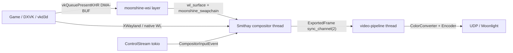

# moonshine — Host & Architecture Analysis

Deep technical analysis of `misc/moonshine/` (v**0.11.0**, commit `ff59fd6`, 2026-07-10), a Sunshine-compatible Moonlight-protocol host written in Rust by **Hans Gaiser**. Goal: mine architecture lessons, protocol completeness, and Linux capture/encode/input specifics before building the **Lyte host** (Swift, Linux-first, H0–H6).

**Related:** [`SERVER.md`](SERVER.md) (Sunshine — closest analogue), [`COMMON.md`](COMMON.md) (client wire formats), [`LYTE-PLAN.md`](../LYTE-PLAN.md) (§2, §5, §6)

---

## 1. Identity, License & Maturity

| Field | Value |
|-------|-------|
| Project | [hgaiser/moonshine](https://github.com/hgaiser/moonshine) |
| Version analyzed | **0.11.0** (workspace.package); CHANGELOG dated 2026-05-16 |
| Commit | `ff59fd6` (Merge PR #117, 2026-07-10) |
| Author | Hans Gaiser (`hansg91@gmail.com`) |
| License | **BSD 2-Clause** (`LICENSE`) — Copyright 2024 Hans Gaiser |
| LOC | ~**26k** lines of Rust (excluding `target/`) |
| Platform | **Linux only** (systemd, Vulkan video encode, Wayland/XWayland) |
| Client floor | Moonlight **≥ v6.0.0** (README); older / unofficial ports not guaranteed |

**GPL compatibility (important for Lyte).** BSD-2-Clause is **GPL-compatible**. Studying this code under our GPLv3 policy (D5 / LYTE-PLAN §4) is fine. Incorporating Moonshine code into a GPLv3 Lyte binary would also be fine license-wise; the practical plan is *study and reimplement in Swift*, not vendoring the Rust crate. Contrast Sunshine (GPLv3) — same study freedom, heavier copyleft if we ever linked.

**What this program is:** a complete Moonlight host that runs each stream in an **isolated headless Wayland compositor** (Smithay), launches the game as a Wayland/XWayland client into that compositor, DMA-BUF-exports frames into a Vulkan video encoder (`pixelforge`), and speaks the GameStream HTTPS + RTSP + ENet + RTP stack.

**What this program is not:** a desktop capture host. It does **not** grab the user's existing session via PipeWire ScreenCast, KMS, NvFBC, or X11. That is the single largest architectural divergence from Sunshine — and the single largest reason it is *not* a drop-in template for Lyte H0 (which targets streaming an existing desktop).

**Maturity.** Actively developed through 2026; real Steam/Proton/HDR/surround path; systemd packaging (AUR); CI; changelog shows security hardening (mTLS, RTSP gating, XSS fix). Still gaming-first: no clipboard, no mic, no multi-display desktop, no web config UI beyond PIN page, incomplete desktop-capture story by design.

---

## 2. Architecture Overview

```
main() ── tokio multi-thread runtime
  ├── Webserver (hyper)     TCP 47989 HTTP + 47984 HTTPS (mTLS fingerprint pin)
  ├── RtspServer            TCP 48010 plaintext RTSP (gated on active session)
  ├── SessionManager        one session at a time (Initialized → Launched → Active)
  │     ├── Compositor      dedicated "compositor" thread (Smithay + calloop)
  │     │                     → ExportedFrame via sync_channel(2)
  │     ├── Application     systemd transient unit (moonshine-session.service)
  │     ├── VideoStream     UDP 47998; pipeline thread + packet task
  │     ├── AudioStream     UDP 48000; PulseServer (mio) + Opus encode thread
  │     └── ControlStream   ENet UDP 47999 (tokio-enet); input + feedback
  ├── ClientManager         pairing crypto + PersistentState (state.toml)
  └── MdnsDiscovery         embedded mdns-sd `_nvstream._tcp` (no avahi)
```

**Process model.** Single process. Tokio owns network servers and the session state machine. Heavy work escapes to OS threads: `"compositor"`, `"video-pipeline"`, `"audio-encode"`, `"pin-notification"`, plus a current-thread tokio runtime inside the gamepad input handler. Shutdown is structured via `async-shutdown::ShutdownManager` with typed reasons (`ShutdownReason` global, `SessionShutdownReason` per-session).

**Workspace crates:**

| Crate | Role |
|-------|------|
| `moonshine` | Binary: clap config path, signal handling, wiring |
| `moonshine-core` | All protocol + session + compositor + streams |
| `moonshine-wsi` | Implicit Vulkan layer (`VK_LAYER_MOONSHINE_wsi_*`) for HDR / XWayland bypass |
| `moonshine-tools` | Bench binary for encode latency profiling |

**Dependency footprint — who does the heavy lifting:**

| Concern | Crate / approach |
|---------|------------------|
| Async runtime | `tokio` 1.52 |
| HTTP | `hyper` 1 + `hyper-util` |
| TLS | `rustls` + `tokio-rustls` + `aws-lc-rs` (RSA/TLS; replaced `ring` in 0.11) |
| Pairing crypto | hand-rolled AES-128-ECB + SHA-256 + RSA-PKCS1 via `aes` / `sha2` / `aws-lc-rs` |
| Stream crypto | `aes-gcm` (control + video), `cbc`+`aes` (audio) |
| RTSP / SDP | `rtsp-types`, `sdp-types` |
| ENet | `tokio-enet` |
| FEC | `fec-rs` (video + audio; audio parity matrix patched) |
| Compositor | forked `smithay` (`master-moonshine`) |
| Encode | `pixelforge` (Vulkan Video — NVENC/AMD/Intel via ICD) |
| Vulkan | `ash` (git pin) |
| Gamepads | `inputtino` (git — uinput/uhid virtual pads) |
| Keyboard/mouse | **Smithay seat** (not uinput/libei) |
| Audio capture | **hand-rolled PulseAudio native-protocol server** (`pulseaudio` crate + `mio`) |
| Opus | `opus` 0.3 |
| App lifecycle | `zbus` → systemd user Manager (`StartTransientUnit`) |
| mDNS | `mdns-sd` (embedded) |

---

## 3. Port Map

Defaults match Sunshine / GFE:

| Port | Proto | Role | Config key |
|------|-------|------|------------|
| 47984 | TCP | HTTPS GameStream (client cert) | `webserver.port_https` |
| 47989 | TCP | HTTP GameStream + `/pin` | `webserver.port` |
| 47998 | UDP | Video RTP | `stream.video.port` |
| 47999 | UDP | Control (ENet) | `stream.control.port` |
| 48000 | UDP | Audio RTP | `stream.audio.port` |
| 48010 | TCP | RTSP | `stream.port` |

No web-config UI port (Sunshine's 47990). Pairing PIN is entered at `http://localhost:47989/pin` or `POST /submit-pin`. Bind address defaults to `0.0.0.0` (IPv4-only); `::` enables dual-stack with `IPV6_V6ONLY=0`. Stream timeout default **60 s** (Sunshine uses 10 s ping timeout).

---

## 4. Module Map (file-by-file)

### Top-level / wiring

| Path | Lines | Role |
|------|------:|------|
| `src/main.rs` | ~125 | clap, logging (`MOONSHINE_LOG`), construct `Moonshine` |
| `moonshine-core/src/lib.rs` | ~30 | module tree + `ShutdownReason` |
| `config.rs` | ~125 | TOML config; default Steam app + Steam scanner |
| `state.rs` | ~150 | `state.toml`: uuid, paired client ids, cert fingerprints |
| `tls.rs` | ~412 | RSA-2048 self-signed cert (10 y); `LenientClientCertVerifier` |
| `crypto.rs` | ~60 | AES-128-GCM encrypt/decrypt (tag split); AES-128-CBC+PKCS7 |
| `clients.rs` | ~347 | Pairing state machine + AES-ECB challenge crypto |
| `discovery.rs` | ~201 | `_nvstream._tcp` via mdns-sd; hostname `<host>-moonshine.local` |
| `rtsp.rs` | ~591 | RTSP server + SDP DESCRIBE/ANNOUNCE |
| `webserver/mod.rs` | ~1139 | HTTP/HTTPS GameStream API |
| `webserver/pairing.rs` | ~297 | `/pair` phases + PIN notification |

### Session

| Path | Lines | Role |
|------|------:|------|
| `session/mod.rs` | ~323 | `SessionContext`, state enum, stream wiring |
| `session/manager.rs` | ~514 | Session lifecycle + watchdog (10 s stop timeout) |
| `session/application.rs` | ~697 | systemd transient unit launch/monitor |
| `session/compositor/*` | ~8k+ | Headless Smithay compositor (see §7) |
| `session/stream/mod.rs` | ~54 | Port/timeout defaults; `RtpHeader` |
| `session/stream/video/*` | ~2k | Pipeline, packetizer, DMA-BUF import, HDR SEI |
| `session/stream/audio/*` | ~2k | PulseServer + Opus + 4+2 FEC |
| `session/stream/control/*` | ~1.5k | ENet control, input, feedback |
| `app_scanner/*` | ~1k | Steam + `.desktop` scanners |

### WSI layer

| Path | Role |
|------|------|
| `moonshine-wsi/` | Implicit Vulkan layer; XCB→Wayland bypass; HDR metadata bridge |

---

## 5. Identity, TLS & Pairing

### Certificate
- Auto-created RSA-2048, CN `"Moonshine"`, **10-year** validity, CA unconstrained, random 64-bit serial (`tls::create_certificate`).
- Stored at `$HOME/.config/moonshine/{cert,key}.pem` by default (expandable paths).
- Same cert serves HTTPS GameStream. No separate web-UI cert (no web UI).

### Lenient client-cert verifier
Mirrors Sunshine's "always accept at TLS layer, authorize in app" pattern (`LenientClientCertVerifier`):
- Offers client auth but **not mandatory** at TLS level.
- Accepts v1/v2/v3; ignores expiry / issuer chain.
- Manual signature verify via aws-lc-rs (bypasses WebPki's X.509 v2 rejection — Moonlight TV clients).
- Real authorization: SHA-256 fingerprint of peer leaf must be in `paired_certs` (`verify_paired_client`).

### Pairing (5 phases, keyed by `uniqueid`)
Crypto matches Sunshine / GFE (AES-128-ECB, `key = SHA256(salt ‖ PIN)[0..15]`):

| Phase | Handler | Notes |
|-------|---------|-------|
| `phrase=getservercert` | parks HTTP until PIN | desktop notification → `/pin?uniqueid=` |
| `clientchallenge` | ECB decrypt → SHA256(chal‖server-sig‖serversecret)‖serverchallenge → ECB | |
| `serverchallengeresp` | store client hash; return serversecret ‖ RSA-SHA256(serversecret) | |
| `phrase=pairchallenge` | unconditional `paired=1` XML | **does not persist yet** |
| `clientpairingsecret` | verify hash + RSA; **then** persist uniqueid + cert fingerprint | |

PIN entry: `POST /submit-pin` with `uniqueid` + `pin` (1 KB body limit); or HTML form at `/pin`. `enable_pairing` config gate. XSS hardened by hex-filtering `uniqueid` on the PIN page.

**Differences vs Sunshine:** Moonshine persists **cert fingerprints** (not full PEM chains); `/unpair` returns success XML but **does not clear state** (stub). Pairing works over both HTTP and HTTPS `/pair`.

### /serverinfo
- `appversion = "7.1.431.-1"` — correct Sunshine marker (negative 4th quad).
- `GfeVersion = "3.23.0.74"`, `MaxLumaPixelsHEVC = 1869449984`.
- `ServerCodecModeSupport` OR of all codec bits including 444/AV1 — **but the 444 bit values diverge from Sunshine** (see §11).
- `PairStatus` = 1 only over HTTPS when `uniqueid` is paired (weaker than Sunshine's "HTTPS ⇒ paired by TLS").
- State: `MOONSHINE_SERVER_{FREE,BUSY}` + `currentgame`.

### /launch & /resume
Required: `appid`, `mode` (`WxHxR`), `rikey` (hex AES-128), `rikeyid` (i64). Optional: `surroundAudioInfo`, `hdrMode`.
- Returns `sessionUrl0` = **`rtsp://…`** (never `rtspenc://`).
- Does **not** generate / return `X-SS-Ping-Payload` or `X-SS-Connect-Data` tokens.
- Does **not** honor `corever` (Sunshine uses `corever≥1` to upgrade to encrypted RTSP).
- Launch waits up to **60 s** (`APP_LAUNCH_HTTP_TIMEOUT_SECS`) for the app to reach systemd active.
- One session at a time; second initialize rejected.
- `/resume` refreshes keys via `watch` channel; resets video frame counters + forces IDR on next PLAY.

---

## 6. Protocol Implementation (end-to-end)

### 6.1 RTSP — plaintext only

- TCP 48010; **one connection per command** (closes after response) — matches Sunshine/Moonlight quirk.
- **Gated:** connections accepted only when a session context exists (post `/launch` or `/resume`); otherwise silently closed.
- Reads UTF-8 into a 2048-byte buffer; **no `rtspenc://` GCM framing**.
- Methods: OPTIONS, DESCRIBE, SETUP, ANNOUNCE, PLAY. No TEARDOWN handler.
- SETUP returns `Session: MoonshineSession;timeout = 90`, `Transport: server_port=<port>` — **no** `X-SS-Ping-Payload`, **no** `X-SS-Connect-Data`.
- Hack: rewrites Moonlight's bare `streamid=` / `PLAY /` into absolute URIs for `rtsp-types` parsing.

**DESCRIBE SDP advertises:**
- `x-ss-general.featureFlags` = `0x02` (controller touch only; no pen/touch 0x01)
- `x-ss-general.encryptionSupported` = ControlV2\|Audio (± Video if `stream.video.encrypt`)
- Sentinels: `sprop-parameter-sets=AAAAAU`, `a=rtpmap:98 AV1/90000`, `refPicInvalidation:1`
- Six `surround-params` lines with GFE LFE-rotation quirk for normal-quality 5.1/7.1

**ANNOUNCE** parses full negotiation surface (resolution, fps, packetSize, bitrate kbps→bps, FEC min, qos, bitStreamFormat 0/1/2, dynamicRangeMode, chromaSamplingType, maxNumReferenceFrames, encryptionEnabled, audio surround + quality + packetDuration). Video encrypt = config AND client flag; audio encrypt = client flag alone.

**PLAY** calls `SessionManager::start_session()` (or no-op+reset on resume).

### 6.2 Control channel (ENet, control-v2 GCM)

- `tokio-enet` host, 128 peers, 1 channel, port 47999.
- Encrypted envelope `0x0001`: `{u16 type, u16 len, u32 seq LE}` + tag(16) + ciphertext.
- IV: seq LE at bytes 0–3; suffix **`HC`** host→client / **`CC`** client→host — matches Sunshine.
- Handled inbound: Ping `0x0200`, InputData `0x0206`, IDR `0x0302`, RFI `0x0301` (**degraded to IDR**), StartB `0x0307`, encrypted wrapper. LossStats/FrameStats/HdrMode inbound logged/skipped.
- Outbound: TerminationExtended `0x0109` with `0x80030023` BE (graceful), HdrMode `0x010e` (30-byte SS_HDR_METADATA), rumble/LED/motion/trigger feedback `0x010b` / `0x5500`–`0x5503`.
- **StartB gates media:** video pipeline + audio encoder wait on `Notify` until StartB; HDR mode sent after StartB.
- Ping refreshes `stream_timeout` (default 60 s). No `StartA` (`0x0305`) handling (Lyte sends StartB — fine).

### 6.3 Video RTP + FEC

Packetizer (`packetizer.rs`) matches Sunshine layout closely:
1. 8-byte `VideoFrameHeader` (type 0x01, latency 0.1 ms units, frameType 1/2, lastPayloadLen).
2. Shard payload = `packetSize − 16` (NvVideoPacket size).
3. Max **4 FEC blocks**/frame; block ≥4 → remaining data **without FEC**.
4. NvVideoPacket: `streamPacketIndex = seq<<8`, `multiFecFlags=0x10`, `fecInfo = (shardIdx<<12)|(dataShards<<22)|(fec%<<4)`.
5. Reed-Solomon via `fec-rs`, default fec% **20**, ≥ client's `minRequiredFecPackets`, ≤255 shards.
6. RTP: header byte `0x90`, PT=0, SSRC=0, 90 kHz timestamp.
7. Optional AES-128-GCM per shard: 32-byte prefix `{iv[12], frameNumber LE, tag[16]}`; IV = u64 counter LE + `iv[11]='V'`. **Default `encrypt: false`.**
8. Client address learned from literal UDP payload **`b"PING"`** only — **not** Sunshine `SS_PING` (16-byte token + BE32).

### 6.4 Audio RTP + FEC

- Opus multistream, `Application::LowDelay`, **VBR off** (CBR), bitrates matching Sunshine (stereo 96k/512k, 5.1 256k/1536k, 7.1 450k/2048k).
- Sample rate **48 kHz**; frame clock default **200 Hz** (5 ms) from PulseServer.
- RTP PT 97 data / 127 FEC; FEC timestamp **0**; 4+2 RS with parity matrix **byte-exact** `77 40 38 0e c7 a7 0d 6c` (comment cites moonlight-common-c).
- Encryption: AES-128-CBC + PKCS7; IV = BE(`rikeyid + seq`) in bytes 0–3, rest zero.
- Client address: again literal **`b"PING"`** only.
- Timestamp construction uses wall-clock micros `/ (1000/90)` (integer → `/11`) — **not** Sunshine's packetDuration-ms units. Worth validating against real clients; Android clients historically picky about audio framing (changelog v0.8 fixed framing bugs).

### 6.5 Input packet parsing

Control `InputData` carries BE32 length + event body. Event type is LE u32:

| Type | Magic | Handled |
|------|-------|---------|
| KeyDown / KeyUp | `0x00000003` / `0x04` | → compositor seat |
| MouseMoveAbsolute | `0x00000005` | → seat |
| MouseMoveRelative | `0x00000007` | → seat (+ relative pointer) |
| MouseButton Down/Up | `0x08` / `0x09` | Linux BTN_* codes |
| MouseScrollVertical | `0x0000000A` | high-res + v120 |
| MouseScrollHorizontal | `0x55000001` | |
| GamepadUpdate | `0x0000000C` | inputtino |
| GamepadEnableHaptics | `0x0000000D` | no-op ack |
| GamepadInfo/Touch/Motion/Battery | `0x55000004`–`07` | inputtino |

**Not implemented:** touchscreen/pen packets, unicode text, Gen7-specific wrappers beyond the encrypted control envelope + BE32 length (Gen5 framing). Keyboard = Windows VK → Linux evdev keycode table → Smithay `Keycode::from(evdev + 8)` (XKB). Layout from `compositor.keyboard` (xkbcommon via Smithay).

---

## 7. Capture & Encode on Linux — the H0-relevant truth

### 7.1 Not desktop capture

Moonshine's compositor module banner states it plainly: it **replaces** Gamescope + PipeWire capture with an in-process Smithay compositor. Frames are GBM DMA-BUFs exported to the encoder. There is **no** PipeWire ScreenCast, KMS grab, portal, or X11 capture path in the current tree.

> "Embedded headless Smithay compositor… replaces the external Gamescope compositor and PipeWire capture. Frames are rendered to GBM-backed DMA-BUFs and exported directly to the video encoder."
> (`moonshine-core/src/session/compositor/mod.rs:1–5`)

*(Historical note: CHANGELOG v0.7 briefly used xdg-desktop-portal + gstreamer; v0.8 replaced that with Smithay + pixelforge. The downloaded tree is the Smithay architecture.)*

### 7.2 Per-session headless compositor (Smithay)

Each streaming session owns a dedicated headless Wayland compositor built on a **forked Smithay** (`hgaiser/smithay`, branch `master-moonshine`). Lifecycle wiring (`session/mod.rs`):

1. `InitializedSession::new` creates `Compositor::new(...)` and passes `handles.frame_rx` to `VideoStream`, `handles.input_tx` to `ControlStream` (`session/mod.rs:155–166`).
2. `launch()` spawns the compositor thread, waits for `CompositorReady`, then spawns the app with `DISPLAY` / `WAYLAND_DISPLAY` (`session/mod.rs:195–210`).
3. Streams start later after RTSP negotiation (`LaunchedSession::start`).

**Smithay features** (`moonshine-core/Cargo.toml:51–60`): `backend_drm` (render-node access), `backend_gbm` (`GbmDevice`/`GbmAllocator`), `backend_egl`, `renderer_gl` (`GlesRenderer`), `wayland_frontend`, `desktop` (`Space`), `xwayland` (+ `X11Wm`), `x11rb_event_source`. There is **no physical KMS output** — rendering targets GBM DMA-BUFs only; render node opened `O_RDWR` from `/dev/dri/renderD*` (env `MOONSHINE_RENDER_NODE`, or `compositor.gpu` match, or heuristic NVIDIA(100) > AMD(50) > Intel(0), `mod.rs:493–605`). No DRM master / CRTC.

**Wayland socket + XWayland:**

- Socket via `ListeningSocketSource::new_auto()` (`state.rs:478–480`); name sent in `CompositorReady` (`state.rs:1508–1512`).
- App env (`application.rs:207–211`): `DISPLAY=:<xdisplay>`, `WAYLAND_DISPLAY=<socket>`, `MOONSHINE_WAYLAND_DISPLAY=<socket>` (for the WSI layer), `ENABLE_MOONSHINE_WSI=1`; if HDR also `DXVK_HDR=1`, `MOONSHINE_HDR=1`.
- XWayland started in `start_xwayland()` (`state.rs:1436–1523`) with `-terminate` (exits when the WM disconnects). On `XWaylandEvent::Ready`, starts `X11Wm`, opens `X11Focus`, sends `CompositorReady { xdisplay, wayland_display, hdr }` — launcher side waits with a **5 s timeout** (`mod.rs:180–182`). Logs to `/tmp/moonshine/xwayland.log` / `xwayland_stdout.log`. Client scale forced to `1.0` (no HiDPI, `state.rs:1485`).
- Globals: wl_compositor, wl_shm, xdg_wm_base, wl_seat `"moonshine"`, wl_output + xdg-output, data device, XWayland shell, relative pointer, pointer constraints, viewporter, wp_presentation, zwp_linux_dmabuf_v1 v5 + feedback, optional wp_color_management_v1 / wp_color_representation_v1 (HDR), private `moonshine_swapchain_factory_v2`, and (HDR only) `gamescope_swapchain_factory_v2` for DXVK probes.

**Virtual output.** `width`/`height`/`refresh_rate` come from `SessionContext` (client request — **not** hard-coded 60). Output construction (`mod.rs:327–358`): `Mode { size, refresh: refresh_rate * 1000 }` (Smithay uses mHz); name `"moonshine-virtual"`, make/model `"Moonshine"` / `"Virtual Output"`; physical size synthesized as a **27″** diagonal (`diag_mm = 686.0`), aspect from resolution (fallback 16:9) — so games querying mm size (e.g. Ghost of Tsushima) see a plausible monitor. Single output only (`space.map_output(&output, (0, 0))`). X11 windows are configured to fill the output on map (`handlers.rs:1817–1819`); XDG toplevels get an initial configure of `(width, height)` (`handlers.rs:1315–1318`).

**Frame timing / vsync emulation** (`mod.rs:431–455`):

- Timer interval `1_000_000_000 / refresh_rate` ns, scheduled with **absolute** `TimeoutAction::ToInstant(next_frame)` to avoid drift from render time (comment notes `ToDuration` produced ~58 Hz instead of 60).
- If behind schedule: snap forward (`next_frame = now + frame_interval`) — no burst catch-up.
- Event-loop timeout is `None` (block until next source) so it doesn't fight the timer (`mod.rs:465–467`). Each tick runs `MoonshineCompositor::render_and_export()` (`state.rs:636`).
- Client pacing: after the GLES path, `window.send_frame(...)` with `Duration::ZERO` delay (`state.rs:895–901`); override/scanout paths call `send_frames_surface_tree` + `wp_presentation_feedback` with `Refresh::Fixed(frame_period)` (`state.rs:907–939`, `1092–1113`, `1247–1278`). Frame period from preferred mode: `1e12 / refresh_mHz` ns, fallback **11 ms** (~90 Hz) (`state.rs:928–932`). Immediate `display_handle.flush_clients()` so clients aren't starved until the next socket activity.
- **Static-screen optimization** (`state.rs:643–647`): skip render if `!screen_dirty` and last sent frame < **1 s** ago; `screen_dirty` set on surface commit, cursor move, etc.; keepalive at least every 1 s. Better idle than Sunshine's fps/2 CBR floor.
- Seat keyboard repeat: delay **200 ms**, rate **25** (`state.rs:473`).

### 7.3 Compositor → encoder handoff

**Exchange type `ExportedFrame`** (`frame.rs:105–128`):

| Field | Meaning |
|---|---|
| `planes: Vec<ExportedPlane>` | borrowed raw DMA-BUF fds + offset/stride |
| `format: u32` / `modifier: u64` | DRM fourcc + modifier |
| `width` / `height` | pixels |
| `created_at: Instant` | production time |
| `buffer_index: usize` | pool / scanout cache key |
| `consumed: Arc<AtomicBool>` | encoder → compositor recycle signal |
| `color_space: FrameColorSpace` | `Srgb` / `Bt2020Pq` / `ScrgbLinear` |
| `hdr_metadata: Option<HdrMetadata>` | CTA-861.G-style static metadata (fallback: BT.2020 primaries / D65 / 1000-nit peak, `frame.rs:77–95`) |

Channel: `std::sync::mpsc::sync_channel(2)` (`mod.rs:140`) — depth 2; `try_send` drops the frame if full and re-marks the buffer consumed.

**Path A — GLES composite** (default / cursor visible / multi-window):

1. Pick next slot in the pre-allocated GBM pool (`BUFFER_POOL_SIZE = 3`, `state.rs:56–59` — three so that two can sit in the channel while one is being encoded).
2. Skip if `consumed == false` (encoder still reading, `state.rs:694–698`).
3. `export_dmabuf` duplicates plane metadata **before** bind (borrow workaround, `state.rs:709–727`, `1557–1587`).
4. `renderer.bind(&mut dmabuf)` → `OutputDamageTracker::render_output` with buffer age (`state.rs:732–851`); clear color black.
5. Cursor composited **into** the frame (see §7.6), then `frame_tx.try_send`.

Render format preference (`mod.rs:258–310`): HDR `Abgr16161616f` → `Abgr2101010` → `Abgr8888` → `Xbgr8888`; SDR `Abgr8888` → `Xbgr8888` → `Argb8888` → `Xrgb8888`. Effective HDR only if the selected fourcc is FP16 or 10-bit (`mod.rs:310`). `Capability::Fencing` is stripped from the GLES renderer (~3% CPU save); frame-level EGLFence / DMA-BUF implicit sync is relied on instead (`mod.rs:241–252`).

**Path B — direct scanout (zero-copy)** (`try_direct_scanout` / `try_direct_scanout_override`, `state.rs:952–1285`). Conditions: cursor **not** visible (auto-hide after 3 s), exactly one window (or WSI override surface active), buffer is a DMA-BUF whose size **exactly** matches the output, window at origin. Exports the client's DMA-BUF plane fds directly; holds the `smithay` buffer until `consumed` (`held_scanout_buffers`). Buffer indices for the encoder cache start at `BUFFER_POOL_SIZE` and key by **wl_buffer ObjectId** (not fd) because NVIDIA/vkd3d re-duplicate fds per commit (`state.rs:384–390`, `1023–1031`).

`frame.rs` is pure data types — no rendering. Pixelforge is used **only on the encode side**; the compositor merely tags frames with formats/modifiers that pixelforge will import.

### 7.4 moonshine-wsi Vulkan layer

`cdylib` Vulkan **implicit layer** `VK_LAYER_MOONSHINE_wsi` (`dist/VkLayer_moonshine_wsi.json`); replaces a forked `VkLayer_FROG_gamescope_wsi` (`lib.rs:1–5`). Enabled by `ENABLE_MOONSHINE_WSI=1`, disabled by `DISABLE_MOONSHINE_WSI=1`; loader interface **v2** via `vkNegotiateLoaderLayerInterfaceVersion`.

**Activation:** connects a **private** Wayland connection to `$XDG_RUNTIME_DIR/$MOONSHINE_WAYLAND_DISPLAY` (`instance.rs:253–292`), binds `wl_compositor` (v4–5) and `moonshine_swapchain_factory_v2` → `LayerStatus::Active`. Env unset / connect fail / injection fail → `Degraded` (passthrough). HDR capability comes from `MOONSHINE_HDR=1`, not from factory presence alone.

**Intercepted calls.** Instance (`lib.rs:194–311`): `vkCreateInstance`, `vkDestroyInstance`, `vkCreateDevice`, `vkCreate{Wayland,Xcb,Xlib}SurfaceKHR`, `vkDestroySurfaceKHR`, surface formats/caps/present modes, XCB/Xlib presentation support, `vkEnumerateDeviceExtensionProperties`. Device (`lib.rs:314–379`): `vkCreateSwapchainKHR`, `vkDestroySwapchainKHR`, `vkQueuePresentKHR`, `vkSetHdrMetadataEXT`, `vkAcquireNextImage(2)KHR`, `vkGetRefreshCycleDurationGOOGLE`, `vkGetPastPresentationTimingGOOGLE`.

**XWayland bypass** (Gamescope-style, `surface.rs:627–712`): on `vkCreateXcbSurfaceKHR`/Xlib, create a **new** `wl_surface` on Moonshine's compositor connection; move the proxy to the default queue via `wl_proxy_set_queue(proxy, NULL)` so the ICD's `wl_display_dispatch` receives frame/release events; back the `VkSurfaceKHR` with that surface — the ICD then presents DMA-BUFs **directly to Moonshine**, skipping XWayland Glamor (critical: Glamor's sRGB linearization would destroy PQ content). The `xcb_window` is stored for `override_window_content` + extent override. Disable with `MOONSHINE_WSI_DISABLE_BYPASS=1`. Bypass safety check `can_bypass_xwayland` (`swapchain.rs:390–439`): child fills the toplevel (±2 px size, ±1 px pos) and no obscuring child > 1×1.

**Swapchain create** (`swapchain.rs:26–186`): optionally remap HDR color spaces → `SRGB_NONLINEAR` for the ICD while the real color space travels via protocol; call next ICD; `moonshine_swapchain_factory.create_swapchain(wl_surface)`; `swapchain_feedback(image_count, vk_format, app_colorspace, ...)`; `set_present_mode`; if bypass allowed, `override_window_content(0, x11_window)` → compositor `override_window_surface`. Present (`swapchain.rs:208–379`): dispatch Wayland events; optional FIFO force via `MOONSHINE_LIMITER_FILE`; inject `SwapchainPresentModeInfoEXT` when maintenance1 is available.

**Injected/advertised extensions:** `VK_KHR_{wayland,xcb}_surface` + `VK_KHR_surface` at instance create; `VK_EXT_swapchain_maintenance1` (+ feature) at device create; `VK_EXT_hdr_metadata` (spec v2) and `VK_GOOGLE_display_timing` (spec v1) enumerated as layer-provided. HDR surface formats advertised when `MOONSHINE_HDR=1` (`surface.rs:44–57`): `A2B10G10R10_UNORM_PACK32`+HDR10_ST2084, `A2R10G10B10_UNORM_PACK32`+HDR10_ST2084, `R16G16B16A16_SFLOAT`+EXTENDED_SRGB_LINEAR. Min image count forced ≥ **3** (`MOONSHINE_WSI_MIN_IMAGE_COUNT`, `surface.rs:203–213`).

**Compositor-side protocol** (`protocols/moonshine-swapchain.xml`, functionally identical to `gamescope_swapchain`; handlers in `gamescope_swapchain.rs`): `create_swapchain` (clears stale HDR state), `swapchain_feedback` (maps VK color space → `TransferFunction`/`Primaries`, replies `refresh_cycle`), `override_window_content` (sets `override_surface`), `set_hdr_metadata` (CTA-861.G mastering metadata into `ColorManagementState`), `set_present_mode`/`set_present_time` (accepted, no-op/plumbing). VK color-space constants handled (`gamescope_swapchain.rs:52–55`): `0` sRGB (clear HDR), `1000104002` EXTENDED_SRGB_LINEAR (scRGB), `1000104008` HDR10_ST2084 (BT.2020+PQ), `1000104014` EXTENDED_SRGB_NONLINEAR (scRGB). Globals: `moonshine_swapchain_factory_v2` **always** registered; `gamescope_swapchain_factory_v2` **only when HDR** (DXVK probes it — gating prevents false HDR detection in SDR sessions).

When the override is active the compositor renders/scanouts that surface instead of the X11 Glamor content (`state.rs:661–688`, `802–823`); input still routes to the X11/Wayland focus window (`input.rs:310–343`). Native `vkCreateWaylandSurfaceKHR` does **not** yet record the app's `wl_surface` (different connection; TODO at `surface.rs:91`) — native-Wayland HDR/bypass is the weak path.

| Render path | When |
|---|---|
| WSI override + direct scanout | Bypass active, cursor hidden, size match |
| WSI override + GLES | Cursor visible or size mismatch |
| Normal space GLES / scanout | No override (native Wayland or bypass disabled) |

### 7.5 Video encode pipeline (`pixelforge` / Vulkan Video)

Thread `"video-pipeline"` (`pipeline/mod.rs:181–183`), gated on `tokio::sync::Notify` until RTSP PLAY (`pipeline/mod.rs:227–232`). Not raw-ash encode — pixelforge wraps the Vulkan Video APIs (`VideoContext`, `Encoder` + `EncodeConfig`, `ColorConverter`); ash is used directly for DMA-BUF import (`dmabuf.rs`) and format enums.

**Codecs** from ANNOUNCE `VideoFormat` (`pipeline/mod.rs:270–274`): H264 → `Codec::H264`, Hevc → `H265`, Av1 → `AV1`.

**Encode session config** (`create_encoder`, `pipeline/mod.rs:261–314`):

```text
EncodeConfig::{h264,h265,av1}(width, height)
  .with_pixel_format(Yuv420 | Yuv444)
  .with_bit_depth(Eight | Ten)          // SDR / HDR
  .with_color_description(bt709 | bt2020_pq)
  .with_rate_control(RateControlMode::Cbr)
  .with_target_bitrate(bitrate)
  .with_frame_rate(fps, 1)
  .with_gop_size(0)                     // infinite GOP
  .with_b_frames(0)                     // low latency
  .with_max_reference_frames(...)       // from client
  .with_virtual_buffer_size_ms(1000/fps)     // VBV = one frame interval
  .with_initial_virtual_buffer_size_ms(0)
```

CBR only (no VBR path); IDR on demand via `encoder.request_idr()`. AV1 warned experimental on NVIDIA (frame-size growth; driver 595.44.3.0+).

**IDR / reset handling** (`pipeline/mod.rs:377–421`): control stream broadcasts IDR requests → `request_idr()`; RFI degrades to IDR; on client reconnect/resume the pipeline resets `frame_number`/`sequence_number` to 0 and forces an IDR (avoids Moonlight reporting "100% frame loss"). If an IDR is pending and no new frame arrives within one `frame_interval`, the pipeline **re-encodes the last input image** without re-import (`pipeline/mod.rs:431–448`). Warns if no frames for 5 s (`pipeline/mod.rs:450`). Device-lost exits the session (`is_device_lost`) — no retry freeze.

**DMA-BUF import** (`dmabuf.rs`): `VK_EXT_image_drm_format_modifier` (`ImageDrmFormatModifierExplicitCreateInfoEXT`), `VK_KHR_external_memory_fd` / `DMA_BUF_EXT`, dedicated allocation, tiling `DRM_FORMAT_MODIFIER_EXT`, usage `TRANSFER_SRC | SAMPLED`. Import cache keyed by **fd + ImportParams** (w/h/format/modifier/plane layouts); TTL **2 s**; sweep every **60** imports (fixes a VRAM leak on long sessions — CHANGELOG v0.11). FD duplicated before `vkAllocateMemory` (import consumes the fd). NVIDIA re-import without the cache costs 0.5–1.5 ms/frame.

Fourcc → Vulkan (`pipeline/mod.rs:40–60`): ABGR/XBGR8888 → `R8G8B8A8_UNORM` (RGBA); ABGR/XBGR2101010 → `A2B10G10R10_UNORM_PACK32`; ABGR/XBGR16161616F → `R16G16B16A16_SFLOAT`; anything else (ARGB…) → `B8G8R8A8_UNORM` (BGRx).

**Color conversion** happens in pixelforge's GPU `ColorConverter` on the video-pipeline thread — **not** in compositor GLES. Output formats (`pipeline/mod.rs:338–343`): 420 SDR → `NV12`, 420 HDR → `P010`, 444 SDR → `YUV444`, 444 HDR → `YUV444P10`. Range/matrix (`pipeline/mod.rs:550–598`):

| Frame color space | Converter | full_range | Encoder VUI |
|---|---|---|---|
| SDR session / `Srgb` | `Bt709` | **true** (full) | `bt709()` |
| `Bt2020Pq` | `Bt2020` | false (limited) | `bt2020_pq()` |
| `ScrgbLinear` | `Bt709LinearToBt2020Pq` | false | `bt2020_pq()` |

Constants: `SCRGB_REFERENCE_WHITE_NITS = 80.0`, `BT2408_SDR_REFERENCE_NITS = 203.0` (`pipeline/mod.rs:33–36`). HDR sessions dynamically switch encoder VUI + converter per frame when content flips SDR↔HDR.

**HDR SEI** (`hdr_sei.rs`) injected on **key frames only** when the encoder VUI is BT.2020+PQ (`pipeline/mod.rs:680–687`); falls back to `HdrMetadata::fallback()` when content has no mastering metadata. H.264: Annex-B SEI NAL type 6, payload types **137** (MDCV) / **144** (CLLI), RGB primary order. H.265: PREFIX_SEI `0x4E01`, same payload types, **GBR** order. AV1: `OBU_METADATA` type 5, metadata_type 2 (MDCV) / 1 (CLL). RBSP emulation prevention applied; inserted before the first VCL NAL / frame OBU.

**RTP timestamp** from PTS: `rtp_timestamp = pts * 90000 / fps` (`pipeline/mod.rs:832`) — proper 90 kHz clock, unlike the audio path's wall-clock hack (§6.4).

**Resolution mismatch:** direct scanout requires an exact match (else GLES); GLES always renders at session size; the encoder's `ColorConverterConfig` is sized to the stream context, so a mismatched game buffer is scaled by the converter — there is **no** dedicated letterbox path. X11/XDG clients are configured to session resolution on map, so mismatch is mainly transient.

### 7.6 Cursor handling

Not a hardware/DRM cursor plane (there is no KMS plane). Cursor is software-composited into the GLES framebuffer via `PointerElement` (`cursor.rs`, `state.rs:754–800`); hidden if no pointer activity yet or inactive > **3 s** (`state.rs:764–772`); direct scanout is skipped while the cursor is visible so it can be blended (`state.rs:676–678`). Default image from the XCursor theme (`XCURSOR_THEME`/`XCURSOR_SIZE`, default size **24**), `Fourcc::Abgr8888` (`cursor.rs:21–41`); client cursor surfaces via `SeatHandler::cursor_image` (`handlers.rs:1464–1467`); hotspot from `CursorImageAttributes`. There is no separate Moonlight cursor stream — the cursor is in the video framebuffer when visible.

### 7.7 Color management

Out-of-tree Wayland protocol implementation (`color_management.rs` — Smithay 0.7 has no built-in support). Globals when HDR is active: `wp_color_manager_v1` v1 and `wp_color_representation_manager_v1` v1. Advertised features: Parametric, SetPrimaries, SetMasteringDisplayPrimaries, ExtendedTargetVolume, SetLuminances, **WindowsScrgb**; TFs sRGB/Gamma22/ST2084PQ; primaries sRGB/BT2020.

Design: single fullscreen surface → **no compositor color conversion**; tag frames and pass pixels through (`color_management.rs:1–10`). `ColorManagementState` tracks `pending`/`current` (wp_color_management commits) and `gamescope_current` (WSI protocol — preferred); `frame_color_space()` prefers BT.2020+PQ over scRGB when both are present. Mastering units: protocol → CTA 0.00002 chromaticity (`/20`), luminance normalized to 0.0001 cd/m². `wp_color_representation` accepts Identity/Full-range RGB only — no YUV on the wire from clients. `wp_image_description_info_v1.done()` is deferred until after `dispatch_clients` to avoid a wayland-backend panic (`mod.rs:399–402`, `color_management.rs:724–728`).

### 7.8 Focus handling (Gamescope heritage)

`focus.rs` ranks windows Gamescope-style: `get_window_priority_key` → transitive tuple (game > non-override-redirect > non-1×1 > non-dropdown > … > map_sequence > damage_sequence). Steam overlay width threshold: **1200 px** (`handlers.rs:537`).

`X11Focus` (`x11_focus.rs`) runtime-`dlopen`s `libX11.so.6` / `libXRes.so.1` — no link-time X11 dependency. Reads/writes root and window properties including `GAMESCOPECTRL_BASELAYER_WINDOW`/`_APPID`, `GAMESCOPE_FOCUSED_APP`, `GAMESCOPE_FOCUSABLE_APPS`/`_WINDOWS`, `STEAM_INPUT_FOCUS`, `STEAM_OVERLAY`, `_NET_WM_PID` (+ XRes PID fallback); sets `GAMESCOPE_XWAYLAND_SERVER_ID = ((display_number + 100) << 8) | display_number` for WSI discovery. `set_input_focus` does an unconditional `XSetInputFocus` (RevertToPointerRoot) for GloballyActive / WM_TAKE_FOCUS games. In `reevaluate_focus`: keyboard vs pointer may split when overlay `input_focus_mode == 2`; dropdowns get pointer but not keyboard; `_NET_ACTIVE_WINDOW` honored; on `surface_associated`, a leave→enter cycle + `XSetInputFocus` handles late wl_surface attach.

### 7.9 Threading model

```
┌─────────────────────┐     sync_channel(2)      ┌──────────────────────┐
│ thread "compositor" │ ──ExportedFrame────────► │ thread "video-pipeline"│
│ calloop EventLoop   │                          │ (blocking + mini tokio)│
│ - Wayland display   │                          │ - DmaBufImporter       │
│ - frame Timer       │                          │ - ColorConverter       │
│ - input channel     │                          │ - Encoder              │
│ - XWayland source   │                          │ - Packetizer           │
│ - listening socket  │                          └───────────┬────────────┘
└─────────┬───────────┘                                      │ tokio mpsc(128)
          │ calloop::channel                                 ▼
          │◄──── CompositorInputEvent ──── ControlStream (tokio)
          │
          │ CompositorReady (sync_channel 1)
          ▼
   Session (tokio) / Application (systemd)
```

| Thread | Loop | Role |
|---|---|---|
| `compositor` | calloop, timeout `None` | Wayland + render + export |
| `video-pipeline` | blocking recv + current-thread tokio for `Notify` | Import / convert / encode / packetize |
| tokio runtime | async | HTTP/RTSP, control, UDP send, app spawn |

Shutdown: `ShutdownManager<SessionShutdownReason>`; compositor exit triggers `CompositorStopped`, encoder exit `VideoEncoderStopped`.

### 7.10 Performance tricks, hacks & compositor limitations

Performance tricks: direct DMA-BUF scanout (skips the GLES blit under GPU saturation); GBM pool 3 + sync_channel 2 + `consumed` atomics (zero-alloc steady state); per-texture fencing disabled (~3% CPU); static-screen skip (<1 Hz idle); DmabufImporter fd cache (avoids 0.5–1.5 ms NVIDIA re-import); ObjectId-keyed scanout indices (NVIDIA allocates a new wl_buffer every frame); absolute frame-timer scheduling.

Notable unsafe/FFI blocks: `EGLDisplay::new` / `GlesRenderer::with_capabilities` (`mod.rs:238–252`); `unsafe { display.get_mut() }` dispatch (`mod.rs:393–411`); X11 `dlsym` transmutes (`x11_focus.rs` `sym!` macro); the entire WSI layer (raw Vulkan C ABI, `wl_proxy_set_queue`, FD/XCB FFI); DMA-BUF Vulkan import `p_next` chaining (`dmabuf.rs:261–285`).

TODOs / incomplete: popup handling stubs (`handlers.rs:411–413`, `1440–1450`); native Wayland surface not bound to moonshine_swapchain (`surface.rs:91`); `FocusState::dirty` tracked but evaluation often forced; packetizer FEC block bit-shift TODO (`packetizer.rs:243`).

| Limitation | Detail |
|---|---|
| Single virtual output | One `"moonshine-virtual"` |
| Forced client size | Windows configured to session resolution |
| Cursor vs scanout | Visible cursor forces GLES path |
| Damage tracking | Used for GLES buffer age only; full frames always encoded |
| No PipeWire | Replaced entirely |
| HDR gamescope global gated | SDR sessions don't advertise the gamescope factory |
| Color mgmt is tags-only | No compositor gamut mapping; encoder does scRGB→PQ |
| Device loss | Encode loop exits the session |
| Channel backpressure | Full frame channel → drop frame, free buffer |

**Compositor/pipeline constants cheat-sheet:**

| Constant | Value | Location |
|---|---|---|
| `BUFFER_POOL_SIZE` | 3 | `state.rs:59` |
| Frame channel depth | 2 | `mod.rs:140` |
| Cursor hide | 3 s | `state.rs:678` |
| Static keepalive | 1 s | `state.rs:645` |
| Keyboard repeat | 200 ms / 25 | `state.rs:473` |
| Physical diagonal | 686 mm (27″) | `mod.rs:338` |
| Steam overlay width | 1200 | `handlers.rs:537` |
| AppId cache TTL | 5 s | `handlers.rs:61` |
| Dmabuf cache TTL / sweep | 2 s / 60 imports | `dmabuf.rs:42–46` |
| SEI MDCV / CLLI types | 137 / 144 | `hdr_sei.rs:309–311` |
| VBV | `1000/fps` ms | `pipeline/mod.rs:309` |
| CompositorReady timeout | 5 s | `mod.rs:180` |
| No-frame warn | 5 s | `pipeline/mod.rs:450` |
| Min WSI images | 3 | `surface.rs:212` |
| Refresh fallback | 11 ms (~90 Hz) | swapchain + presentation feedback |

**End-to-end data path:**



### 7.11 What this means for Lyte H0

This path proves Vulkan Video encode + DMA-BUF import + CBR low-latency settings work on Linux. It does **not** prove PipeWire→VAAPI/NVENC. H0 still needs a capture backend Moonshine abandoned.

---

## 8. Input Injection

**Two paths:**

1. **Keyboard / mouse → Smithay seat** (compositor-local). No uinput, no libei, no evdev write. Events arrive on the compositor thread via `calloop::channel` as `CompositorInputEvent` (`input.rs:22–45`: `KeyDown/Up`, `MouseMoveAbsolute/Relative`, `MouseButtonDown/Up`, `ScrollVertical/Horizontal`) and become Wayland seat events:
   - Keys: Windows VK (single byte, `buffer[1]`) → Linux evdev keycode table → Smithay `Keycode::from(evdev + 8)` (XKB offset). Layout from `compositor.keyboard` config (xkbcommon).
   - Absolute mouse: scaled from client screen size to output size. Relative: `relative_motion` + optional pointer-constraint lock + absolute motion.
   - Scroll: `AxisFrame` with `value = ∓amount/120 × 15` and `v120(∓amount)` — vertical is negated, horizontal is not (`input.rs:219–232`).
   - Pointer activity resets the 3 s cursor-hide timer; cursor clamp expands to include dropdown `override_window` geometry.
   - Surface-under-cursor priority (`find_surface_under`, `input.rs:277–351`): dropdown `override_window` (when WSI override inactive) → focused game window / override surface when WSI bypass active → normal `space.element_under`.
2. **Gamepads → inputtino** (uinput/uhid). XboxOne / PS5 / Switch by client `GamepadKind`. Motion, touchpad, battery, rumble, RGB LED, adaptive triggers, trigger rumble — feedback encrypted back on control channel. Auto-create default pad if `GamepadUpdate` arrives before `GamepadInfo` (Android OSC). Optional hold-to-Home remap on Back/Select.

**Implications for Lyte:** Moonshine's kb/mouse injection only works because the app runs *inside* Moonshine's compositor. A Lyte host capturing an existing desktop must use **uinput and/or libei** (as LYTE-PLAN §6 already states) — study Sunshine/`inputtino` for that, not Moonshine's seat path. Steal the gamepad/inputtino integration and the control-feedback loop.

---

## 9. Audio Capture

### 9.1 In-process PulseAudio server — not system capture

Moonshine does **not** capture from system PulseAudio/PipeWire. It implements a **minimal PulseAudio native-protocol server** in-process (`session/stream/audio/pulse_server/`, using the `pulseaudio` crate 0.3.1). Apps launched for the session are pointed at this socket; their playback streams are accepted, mixed, resampled, Opus-encoded, and sent over UDP RTP. It does **not** capture host desktop audio or microphone (`GetSourceInfo` → `NoEntity`; no `CreateRecordStream`); `localAudioPlayMode` is explicitly unsupported.

**Socket and env injection:**

| Item | Value |
|------|--------|
| Directory | `{dirs::runtime_dir()}/moonshine/pulse` (typically `$XDG_RUNTIME_DIR/moonshine/pulse`) |
| Socket file | `native` → e.g. `/run/user/<uid>/moonshine/pulse/native` |
| Bind timing | `AudioStream::new` binds **before** app launch so the app can connect immediately |
| Stale cleanup | `remove_file` on the socket path before bind |
| App env (`application.rs` `make_envs`) | `PULSE_SERVER=unix:{socket}`, `PULSE_RUNTIME_PATH={parent dir}` |

Protocol version: clients negotiate `min(client_version, pulse::MAX_VERSION)`; the crate's `MAX_VERSION = 35`. Server name `"Moonshine"`, dummy sink `"moonshine"` ("Moonshine virtual output"); advertised `stream_latency` / `sink_usec` / `configured_sink_latency` = **10000 µs** (10 ms), hardcoded, not measured.

**Implemented PA commands** (`commands.rs` `handle_command`): `Auth`, `SetClientName`, `GetServerInfo`, `GetClientInfo(List)`, `GetCardInfo(List)` (NoEntity/empty), `GetSinkInfo(List)` (dummy sink), `GetSourceInfo` (NoEntity), `GetSource(Output)InfoList` (empty), `Subscribe` (ACK), `CreatePlaybackStream`, `DrainPlaybackStream`, `GetPlaybackLatency` (synthetic 10 ms), `UpdatePlaybackStreamProplist`, `Cork/Flush/Trigger/PrebufPlaybackStream`, `SetSinkInputVolume/Mute`, `SetSinkVolume/Mute`, `DeletePlaybackStream`, `LookupSink` (only `"moonshine"` → index 1), `Stat`, `GetSinkInputInfo(List)`, `SetPlaybackStreamBufferAttr`, `GetModule/SampleInfoList` (empty), `Extension` (NoExtension), everything else → `NotImplemented`. Stream data path: when descriptor `channel != u32::MAX`, `handle_stream_write` appends PCM bytes to the stream buffer (with overflow clipping).

**Capture format:** `CAPTURE_SAMPLE_RATE = 48000`, `Float32Le`, channels negotiated 2 / 6 / 8 (stereo; FL FR FC LFE RL RR; + SideLeft SideRight). Client formats accepted (`is_supported_format`): `U8`, `S16Le/Be`, `Float32Le/Be`, `S32Le/Be`, `S24Le/Be`; any client sample rate accepted, resampled if ≠ 48000. `fix_channels` forces the sink channel count/map (Wine pulse probing).

**Stream lifecycle:** `CreatePlaybackStream` builds a `PlaybackStream` with a `DynPlaybackBuffer` targeting 48 kHz f32 at the negotiated channel count; buffer attrs sanitized by `configure_buffer`; state starts `Prebuffering` (or `Corked` if `start_corked`); initial `missing = target_length` seeds the REQUEST in the create reply; after prebuffer fills → `Started` → `Playing`. A `TimerFd` audio clock drains/mixes every tick and sends `REQUEST` / `Underflow` / drain ACKs. The mio accept loop starts only at stream start — the socket is bound earlier so connects queue in the listen backlog until `PulseServer::spawn`.

### 9.2 Buffering, resampling, mixing (`buffer.rs`, `dyn_buffer.rs`)

Two layers: `Buffer<F>` — a `VecDeque<u8>` of raw PCM converted to f32 frames with channel up/downmix — and `PlaybackBuffer<F>` — passthrough or sinc-resampled view. `DynPlaybackBuffer` selects `Stereo([f32;2])` / `Surround51([f32;6])` / `Surround71([f32;8])`. Channel conversion in `Buffer::read_frame`: same count → passthrough; mono → both FL/FR; fewer → zero-pad; more → stereo via ITU-R BS.775-style `DownmixCoeffs` (`GAIN_CENTER = 1/√2`), otherwise take the first `F::CHANNELS`.

Resampling uses `dasp` (features `signal`, `interpolate`, `interpolate-sinc`, `ring_buffer`): same rate → `Passthrough`; different rate → `dasp::interpolate::sinc::Sinc` over a `ring_buffer::Fixed` of **32 frames** with `Signal::from_hz_to_hz`.

Buffer sizing (`configure_buffer`; `len_10ms = frame_size * sample_rate / 100`):

| Attr | Default (`u32::MAX`) | Otherwise |
|------|----------------------|-----------|
| `max_length` | `len_10ms * 20` → **~200 ms** | round up to frame; cap ~1 s |
| `minimum_request_length` | `len_10ms / 2` → **~5 ms** | round up; min `len_10ms/2` |
| `target_length` | `len_10ms * 6` → **~60 ms** | ≥ 60 ms, ≥ `2*min_req`, ≤ max |
| `pre_buffering` | = target (~60 ms) | aligned to `min_req`, ≤ target |

Demand accounting mirrors PA memblockq (`missing`, `requested`, `pop_missing`). Overrun: writes exceeding `max_length` emit `Command::Overflow(excess)` and truncate. Underrun: if `drain_and_mix` returns false while Playing/Draining, emit `Command::Underflow`; if `pre_buffering > 0`, re-enter `Prebuffering` with `missing = pre_buffering`. Seek offsets on stream writes are **ignored** (warn only). Uncork deliberately issues an immediate REQUEST with `in_prebuf=true` "for low startup latency."

**Mixing:** every clock tick allocates/recycles an `AudioFrame` zeroed to `num_frames * channels`; every client's every Playing/Draining stream **adds** (`+=`) volume-scaled samples into the same buffer via `drain_and_mix`; sink mute/volume applied; `try_send` to the encoder. Concurrent apps are summed. Silence is continuous — with no playing streams the clock still builds a zero frame and the encoder still encodes and sends RTP(+FEC); the stream never goes quiet.

### 9.3 Opus encoding (`encoder.rs`)

```text
opus::MSEncoder::new(48000, streams, coupled_streams, &mapping[..channels],
                     opus::Application::LowDelay)
```

- **CBR**: `set_vbr(false)` — comment: "Moonlight expects a constant bitrate".
- Bitrate from the selected config; 48 kHz only at encode time.

Opus configs (`audio/mod.rs`, "matching Sunshine's behavior"):

| Const | Ch | streams | coupled | mapping | bitrate |
|-------|----|---------|---------|---------|---------|
| `OPUS_STEREO` | 2 | 1 | 1 | `[0,1]` | 96_000 |
| `OPUS_HIGH_STEREO` | 2 | 1 | 1 | `[0,1]` | 512_000 |
| `OPUS_SURROUND51` | 6 | 4 | 2 | `[0,1,4,5,2,3]` | 256_000 |
| `OPUS_HIGH_SURROUND51` | 6 | 6 | 0 | identity | 1_536_000 |
| `OPUS_SURROUND71` | 8 | 5 | 3 | `[0,1,4,5,6,7,2,3]` | 450_000 |
| `OPUS_HIGH_SURROUND71` | 8 | 8 | 0 | identity | 2_048_000 |

Selection: `AudioConfig::from_channels(channels, mask, high_quality)`. For SDP only, normal-quality 5.1/7.1 configs get the GFE **LFE-rotated** mapping (§6.1); the encoder uses the unrotated mapping.

**Frame duration** comes from the Pulse clock: RTSP `packetDuration` ∈ {5, 10} ms → clock 200/100 Hz; anything else → `DEFAULT_CLOCK_RATE_HZ = 200` (5 ms) with a warning. `num_frames = 48000 / clock_rate_hz` → 240 samples (5 ms) or 480 (10 ms).

**FEC (post-encode):** `NR_DATA_SHARDS = 4`, `NR_PARITY_SHARDS = 2`, `MAX_SHARD_SIZE = 2048`. Parity matrix hardcoded to the OpenFEC/Moonlight bytes `[0x77, 0x40, 0x38, 0x0e, 0xc7, 0xa7, 0x0d, 0x6c]` via `set_parity_matrix` because `fec-rs`'s default matrix doesn't match Nvidia/Moonlight (TODO: "very ugly"). RTP: audio PT 97 header `0x80`; FEC PT 127 + `AudioFecHeader`; timestamp = wall-clock micros `/ (1000/90)` (TODO in source: "Figure out the 1000 / 90 value"). Encryption (client flag): AES-128-CBC, IV = BE(`rikeyid + sequence_number`) in bytes 0–3, rest zero. Encode buffer `vec![0u8; 1400]` (TODO: "Decide the correct size").

### 9.4 Pipeline channels and gating

```
PulseServer (clock)
    --crossbeam_channel::bounded(3)--> AudioEncoder ("audio-encode" thread)
    <--crossbeam_channel::bounded(3)-- (frame recycle, pre-seeded 3 empties)
    --tokio::mpsc::channel(10)-------> spawn_handle_audio_packets (async)
    --UDP send_to--------------------> client
```

PulseServer starts immediately on `AudioStream::start`; the encoder and UDP handler wait on an `Arc<Notify>` until `AudioStartHandle::trigger()` — fired by control-stream **StartB**. The UDP sender learns the client address from the first payload equal to `b"PING"`, then `send_to`s each packet; QoS `set_tos_v4(224)` for audio (video uses 160); bind port default **48000**.

Backpressure: encoder `try_send` Full → stash `spare_frame` and **drop that tick's audio**; recycle-pool exhaustion → allocate a fresh zero frame (avoids encoder deadlock). `capture_ts_ms` is set by Pulse but unused for RTP — timestamps come from `Instant`.

**Latency budget:** PA target ~60 ms / max ~200 ms / min-request ~5 ms / prebuffer ~60 ms; advertised sink latency fixed 10 ms; Opus frame 5 ms (or 10); frame queue depth 3 (~15–30 ms if full); packet queue 10. No user-facing tuning beyond RTSP `packetDuration` and client buffer attrs; the only config key is `stream.audio.port` (default 48000).

Shutdown reasons: `AudioPacketHandlerStopped`, `PulseServerStopped`, `AudioEncoderStopped` — any tears down the session.

**For Lyte H2:** the embedded PA server is a clever isolation trick for game sessions. For desktop streaming, PipeWire capture of the default monitor (Sunshine's approach) is the right path — but the Opus/CBR/FEC/CBC packetization here is a clean reference implementation in safe Rust.

---

## 10. Session / State Management

State machine enforced by enum:

```
Initialized  →  Launched  →  Active
   (comps+streams constructed; app not started)
                 (compositor+systemd unit running; RTSP pending)
                              (StartB fired; media flowing)
```

- Single session; `/cancel` → `stop_session` (UserStopped).
- App exit → `ApplicationStopped` → session teardown.
- Any stream/compositor death → typed `SessionShutdownReason` → watchdog resets.
- Stop timeout **10 s** then **triggers global process shutdown** (orphaned-task insurance — similar spirit to Sunshine's teardown watchdog).
- Resume: update keys via `watch::channel`; accept re-ANNOUNCE; PLAY resets video counters + IDR; streams keep sockets.
- Persistent state: `$XDG_DATA_HOME/moonshine/state.toml` `{unique_id, clients[], paired_certs[]}`.

App launch env includes Wayland/X11 displays, Pulse socket, HDR flag, Vulkan layer path (`ENABLE_MOONSHINE_WSI`, `VK_ADD_LAYER_PATH`, etc.).

---

## 11. Could the Lyte Client Stream from Moonshine Today?

**Verdict: No — not without client changes.** Protocol overlap is high, but three concrete gaps block the shipping Lyte client:

| Requirement (Lyte @ Sunshine 7.1.431 level) | Moonshine | Impact |
|---------------------------------------------|-----------|--------|
| Encrypted RTSP (`rtspenc://` via `corever=1`) | Returns plain `rtsp://`; no GCM framing | Lyte *supports* plaintext RTSP (key only set if URL prefix is `rtspenc://`) — **not blocking** |
| Control-v2 GCM | Implemented (`HC`/`CC` IVs) | OK |
| Gen5/7 input over encrypted control | BE32-framed InputData after GCM decrypt | OK for kb/mouse/gamepad; no touch/pen/unicode |
| Audio 4+2 FEC + AES-CBC + Nvidia parity matrix | Yes, byte-exact matrix | OK |
| Video RTP + RS FEC | Yes; video GCM off by default | OK if Lyte doesn't require video encrypt |
| `X-SS-Ping-Payload` on SETUP → SS_PING | **Missing**; host accepts only literal `"PING"` | **Blocking:** Lyte's `LyteSession` only starts audio when ping payload is present; video falls back to 16 zero bytes, which Moonshine ignores → **no client address learned → no media sent** |
| `X-SS-Connect-Data` for ENet | **Missing** | ENet accepts any peer (128 slots) — usually OK |
| Correct SCM 444 bit flags | Moonshine uses `0x00040000`/`0x00080000`/… for 444 | Sunshine/COMMON use `0x0008`/`0x1000`/`0x2000`/… — **444 capability advertisement is wrong**; 4:2:0 HEVC bits are correct |
| Desktop session to stream | Isolated game compositor only | Product mismatch for Lyte's desktop use case |

**Official Moonlight** likely still works (legacy `"PING"` fallback when ping payload absent). Lyte was built against Sunshine's modern path and does not send legacy PING.

Minimal Lyte-side unblock (if we ever want Moonshine as a test oracle): fall back to ASCII `"PING"` when `X-SS-Ping-Payload` is absent, and start audio without requiring the header. Host-side fix Moonshine would need: emit ping payload + accept SS_PING (and ideally `rtspenc://`).

---

## 12. What It Does Well / What to Steal

Concrete design choices worth copying into the Swift Lyte host:

1. **Typed session state machine** (`Initialized` / `Launched` / `Active`) — impossible to start streams before launch or double-launch. Swift analogue: enum-driven actor, exhaustively switched.
2. **Structured shutdown reasons** — every subsystem holds a trigger token; death of any piece tears down the session with a named cause. Maps cleanly to Swift `AsyncStream` / structured concurrency cancellation.
3. **StartB gating** — construct sockets/pipelines early, block encode/send on a notify until the client is ready. Avoids wasting encode work and simplifies resume.
4. **Key rotation via `watch` channel** — `/resume` updates keys; video/audio/control read eagerly. No restart required.
5. **Idle silence ≤1 fps** on static compositor content — proof that clients tolerate frame gaps; validates LYTE-PLAN's "depart from Sunshine's fps/2 CBR floor" thesis.
6. **Direct DMA-BUF scanout** when possible — skip GLES blit; ObjectId-keyed import cache for NVIDIA fd churn.
7. **Audio FEC parity matrix override** — documents and implements the Nvidia-compatible bytes; do not "fix" this with a pure RS library default.
8. **Surround-params LFE rotation** — GFE bug compatibility in DESCRIBE; easy to miss.
9. **mTLS fingerprint pin + lenient TLS verify** — same Sunshine pattern, cleanly done in rustls.
10. **Embedded mDNS** (no avahi dependency) — good for single-binary Linux distribution (H6).
11. **Empirical HDR gating** — advertise HDR only if config ∧ GPU format probe; send HdrMode from *actual* frame color space.
12. **Resume = reset frame counters + IDR** — prevents false "poor connection" on reconnect.
13. **XML errors as HTTP 200** — Moonlight Qt swallows HTTP 4xx bodies; status lives in XML. Keep this quirk.

---

## 13. What It Lacks / Cautionary Tales

1. **No desktop capture** — wrong architecture for Lyte H0–H2 as currently planned (PipeWire/portal of the logged-in session).
2. **No encrypted RTSP** — Lyte/Sunshine baseline includes it; Moonshine skipped it (security README even warns GameStream isn't fully encrypted).
3. **Legacy-only UDP PING** — modern SS_PING / ping-payload path absent; breaks Sunshine-era clients that don't fall back.
4. **Wrong SCM 444 bit values** — do not copy `ServerCodecModeSupport` enum from Moonshine; copy from Sunshine/`SERVER.md` §4 / COMMON.
5. **Video encryption off by default** — and optional; Lyte's "encrypt always" policy is stricter.
6. **RFI silently → IDR** — same as most Sunshine encoders; don't advertise refPicInvalidation as real RFI unless implemented.
7. **One session, gaming focus** — no multi-monitor desktop, no placebo "Desktop" app that streams the existing session, no clipboard/file/print channels.
8. **`/unpair` is a stub**; pairing PIN page is the only "UI".
9. **Loss stats ignored** — decorative, like Sunshine.
10. **Native Wayland HDR/bypass incomplete** in WSI layer (XWayland-centric).
11. **systemd hard dependency** for app lifecycle — fine for gaming hosts; awkward for a copy-one-binary desktop host unless optional.
12. **Keyboard `from_bytes` uses `buffer[1]`** as VK — works for single-byte VKs; verify against extended keys before copying the parser.
13. **Security posture:** README says not for public networks; no UPnP; relies on VPN for WAN. Aligns with Lyte's LAN-first + later P2P plan.

---

## 14. Critical Constants (Quick Reference)

```
Ports: HTTP 47989, HTTPS 47984, video 47998, control 47999, audio 48000, RTSP 48010
appversion "7.1.431.-1"   GfeVersion "3.23.0.74"   MaxLumaPixelsHEVC 1869449984
Stream timeout default 60 s   Session stop watchdog 10 s   Launch HTTP wait 60 s
Cert: RSA-2048, 10 years, CN Moonshine
Pairing: key = SHA256(salt‖PIN)[0..16], AES-128-ECB challenges
RTSP: plaintext only; sessionUrl0 = rtsp://…; no X-SS-Ping-Payload / Connect-Data
Encryption flags: ControlV2=0x01, Video=0x02, Audio=0x04
Control GCM IV: seq LE + 'H''C' / 'C''C'; tag before ciphertext
Video FEC: 20% default, ≤4 blocks, ≤255 shards; RTP 0x90 PT=0; optional GCM iv+'V'
Audio FEC: 4+2, parity 77 40 38 0e c7 a7 0d 6c; PT 97/127; CBC IV=BE(rikeyid+seq)
Audio: 48 kHz f32 → Opus CBR LowDelay; stereo 96k/512k; 5.1 256k/1536k; 7.1 450k/2048k
UDP client learn: literal "PING" only (not SS_PING)
Compositor: sync_channel(2), GBM pool 3, cursor hide 3s, static keepalive 1s
Encode: Vulkan Video via pixelforge; CBR; VBV=1 frame; GOP infinite; B=0
Pulse socket: $XDG_RUNTIME_DIR/moonshine/pulse/native
State: $XDG_DATA_HOME/moonshine/state.toml
mDNS: _nvstream._tcp on HTTP port; hostname <host>-moonshine.local
```

---

## 15. Direct Implications for the H-Ladder

Mapping onto LYTE-PLAN §6 milestones:

### H0 — Spike: pixels off a Linux box
**Moonshine de-risks:** Vulkan Video encode works; DMA-BUF→GPU convert→CBR HEVC path is proven; RTP/FEC packetization including the 4-block limit and NvVideoPacket packing is a clean reference; idle ≤1 fps is viable.
**Leaves open (do not copy):** capture. H0 still needs PipeWire/portal (or KMS) of the *existing* session — the architecture Sunshine has and Moonshine rejected. Prefer Sunshine's PipeWire path + Moonshine's packetizer/encode settings.
**Suggested revision:** none to the H0 goal; treat Moonshine as the *encode/packetize* oracle and Sunshine as the *capture* oracle.

### H1 — Session server
**De-risks:** pairing crypto, mTLS fingerprint pin, lenient cert verify, RTSP ANNOUNCE surface, control-v2 GCM, StartB gating, session state machine, resume/key rotation.
**Must not copy:** missing `rtspenc://`, missing ping-payload/SS_PING, wrong SCM 444 bits, stub unpair.
**Revision:** H1 acceptance tests should include (a) encrypted RTSP, (b) SS_PING with `X-SS-Ping-Payload`, (c) SCM bits matching SERVER.md — Moonshine proves these are easy to get subtly wrong while still working with stock Moonlight.

### H2 — Input + audio
**De-risks:** Opus CBR + 4+2 FEC + CBC IV construction + Nvidia parity matrix; surround-params DESCRIBE quirk; gamepad via inputtino including feedback; hold-to-Home as optional UX.
**Do not copy for kb/mouse:** seat injection. Lyte needs uinput/libei into the real session.
**Audio capture:** prefer PipeWire monitor capture (Sunshine) over embedding a PA server — unless we later add isolated app sessions as a mode.

### H3 — Feature channel + clipboard
**No help.** Moonshine has no feature channel, no clipboard. Prior art remains Foundation-Sunshine / Moonlight-VPlus (`IDX_CLIPBOARD` 0x5508) as noted in LYTE-PLAN §5.

### H4 — 4:4:4 + policy
**Partial help:** Moonshine negotiates `chromaSamplingType` and feeds `PixelFormat::Yuv444` / `YUV444P10` into pixelforge — evidence the Vulkan Video path can do 444 on capable GPUs. SCM advertisement is **wrong** — fix against SERVER.md. Does not help VAAPI 4:4:4 (Sunshine §8 gap remains).
**Idle/rate-control lesson:** 1 s static skip + single-frame VBV CBR is a starting point; Lyte still wants damage-driven true silence + loss-driven adaptation.

### H5 — Desktop conveniences
**No help** (files/print). Reinforces that these are Lyte-only channels.

### H6 — Single-binary + macOS host toggle
**De-risks:** embedded mDNS (no avahi); rustls-only TLS; "one binary + system GPU/PipeWire" packaging story. systemd-as-hard-dep is a caution — keep app lifecycle optional for copy-one-file UX.
**macOS host:** Moonshine is Linux-only; no VideoToolbox/ScreenCaptureKit lessons. Stick with SERVER.md §11 + LYTE-PLAN H6.

### Cross-cutting revisions suggested by this analysis
1. **Keep Sunshine as the desktop-capture reference; Moonshine as the "clean-room protocol + Vulkan encode" reference.** Neither alone is the Lyte host.
2. **Add an explicit H1 wire-compat checklist item:** `X-SS-Ping-Payload` + SS_PING + `rtspenc://` + SCM bit-exactness — Moonshine shows a host can feel complete to Moonlight while failing a Sunshine-era client.
3. **Isolated-compositor mode is a future product option**, not H0–H2. Attractive for "stream a game while using the desktop" (Moonshine's headline feature) but orthogonal to "use my Linux box as a remote workstation."
4. **License is not a blocker** — BSD-2-Clause study/reuse is cleaner than many expect; still reimplement in Swift.

---

## 16. Summary

Moonshine is a mature, BSD-licensed, Linux-only Sunshine *compatible* host that independently proves a from-scratch non-C++ GameStream server is tractable. Its treasure is a clean session state machine, correct control-v2 / audio-FEC / pairing crypto, a working Vulkan Video encode pipeline with DMA-BUF zero-copy, and an elegant isolated-compositor architecture for gaming. Its gap relative to Lyte is structural: it captures a *virtual* session it owns, not the user's desktop, and it omits the modern Sunshine wire pieces (`rtspenc://`, SS_PING payloads) that our client already depends on. Study it for H1 protocol server shape and encode/packetize details; study Sunshine for PipeWire capture, uinput/libei input, and byte-exact SCM/ping/RTSP encryption. Do not treat Moonshine as a substitute for either — and do not expect the shipping Lyte client to stream from it without a legacy-PING fallback.
